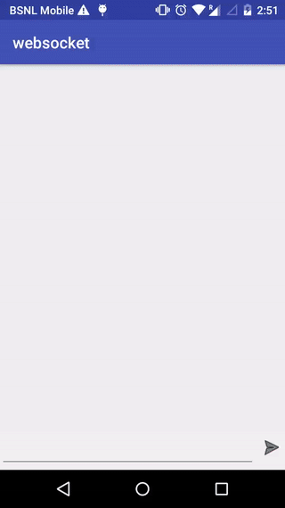

# android-websockets

This is an example of how you can interact with WebSockets in android.

**Basic information about libraries which I used in this project:**
- OkHttp(v3.5): To call WebSocketsLower versions are not supported for this approach).
- ButterKnife: for binding views
- Android Design: for recyclerview

**Quick Explanation:**      
You just need to extend a WebSocketListener class after that you can override methods to send and receive 
messages(See WebSocketEcho class in this example).

Here I used ws url(ws://echo.websocket.org) to setup websockets but if you want to see server side code you can check my 
nodejs based websockets implementation in websockets-nodejs repository.
